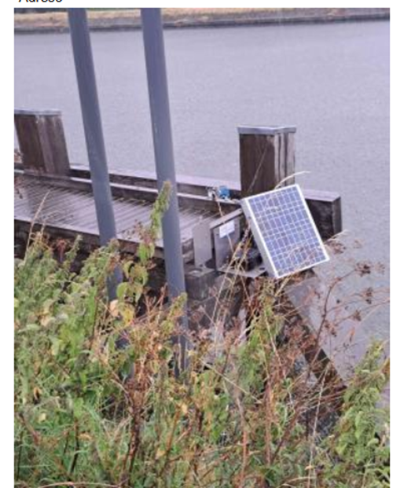
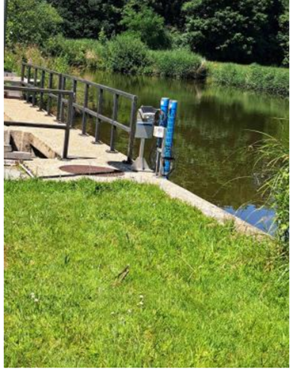
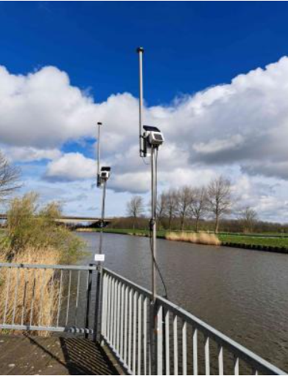
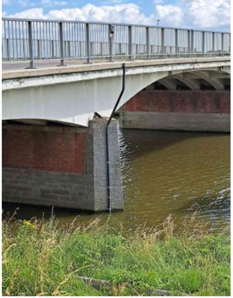
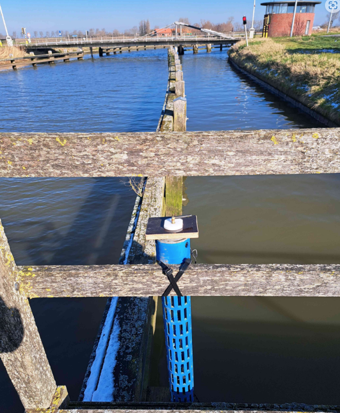
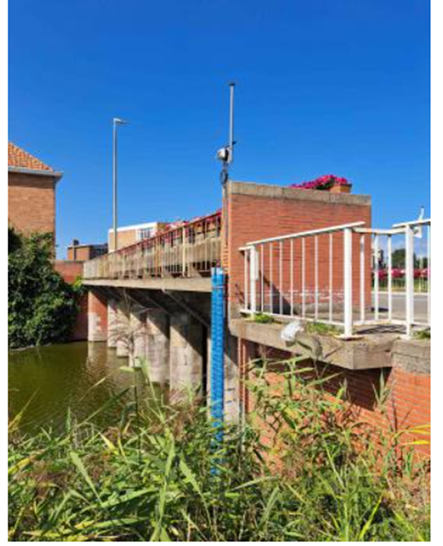
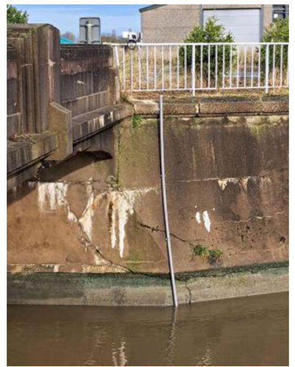

# Resultaten

```{r}
knitr::opts_chunk$set(fig.width=10, fig.height=15) 
```

```{r include=FALSE}
source("./code/not_functions/libraries.R")
source("./code/functions/f.read_excel_allsheets.R")
```

## Aangepast spuibeheer ter hoogte van de zout-zoetovergangen aan de Belgische kust en ingeschat effect op de intrek van glasaal

```{r warning=FALSE, message=FALSE, include=FALSE, cache=TRUE}
RUN=FALSE
output="html"
if (RUN==TRUE){
  source("./code/not_functions/combine_all.R")
}
if (RUN==FALSE){
  os <- read.csv("./data/spuibeheer/intern/os_cleaned.csv") %>% 
    dplyr::mutate(open = as.POSIXct(open, format = "%Y-%m-%d %H:%M:%S", tz = "GMT"),
                  dicht = as.POSIXct(dicht, format = "%Y-%m-%d %H:%M:%S", tz = "GMT")) %>%
    dplyr::select(-X) %>%
    dplyr::filter(duration<10000)
  
  debiet <- read.csv("./data/intern/debiet.csv") %>% 
    dplyr::mutate(datum.debiet = as.POSIXct(datum.debiet, format = "%Y-%m-%d %H:%M:%S", tz = "GMT")) %>%
    dplyr::select(-X)
  
  conductiviteit <- read.csv("./data/intern/ctd_vmm.csv") %>% 
    dplyr::mutate(datum.conductiviteit = as.POSIXct(datum.conductiviteit, format = "%Y-%m-%d %H:%M:%S", tz = "GMT"),
                  datum.neerslag = as.POSIXct(datum.neerslag, format = "%Y-%m-%d %H:%M:%S", tz = "GMT"),
                  datum.debiet = as.POSIXct(datum.debiet, format = "%Y-%m-%d %H:%M:%S", tz = "GMT"),
                  group_plot = as.factor(group_plot)) %>%
    dplyr::select(-X)
  
  ctd <- read.csv("./data/intern/ctd.csv") %>% 
    dplyr::mutate(datum.ctd = as.POSIXct(datum.ctd, format = "%Y-%m-%d %H:%M:%S", tz = "GMT"),
                  datum.neerslag = as.POSIXct(datum.neerslag, format = "%Y-%m-%d %H:%M:%S", tz = "GMT"),
                  datum.debiet = as.POSIXct(datum.debiet, format = "%Y-%m-%d %H:%M:%S", tz = "GMT"),
                  group_plot = as.factor(group_plot)) %>%
    dplyr::select(-X)
}
```

```{r eval=FALSE}
debiet %>% 
  mutate(jaar=lubridate::year(datum.debiet)) %>%
  group_by(jaar,loc.debiet) %>%
  summarize(mean=mean(debiet,na.rm=TRUE),min=min(debiet,na.rm=TRUE),max=max(debiet,na.rm=TRUE))
```

De resultaten van de monitoring van het aangepast spuibeheer tonen aan dat dit beheer een wisselende, maar continue, impact had op de stroomopwaartse migratie van glasaal. In **2022**, konden naar schatting **323.199** glasalen passeren, maar belangrijk om te noteren is dat de Noordede toen niet werd beschouwd. In **2023** hebben de inschattingen aangegeven dat **550.392** glasalen passeerden. Dit aantal steeg in **2024**, tot **671.014** glasalen. De inschattingen voor **2025** geven aan dat **315.794** glasalen passeerden.

```{r}
os.summary <- os %>% 
  dplyr::filter(jaar == 2025 & datum < as.POSIXct("2025-05-15 12:00:00", tz = "Europe/Brussels") & datum > as.POSIXct("2025-02-27 00:00:00", tz = "Europe/Brussels")) %>% 
  group_by(site) %>%
  summarize(start = as.Date(min(open)),
            stop = as.Date(max(dicht)),
            periode = as.numeric(round(stop - start)),
            aantal.dagen.effectief.os = n_distinct(datum),
            events = n(),
            events.per.dag = round(events/aantal.dagen.effectief.os, digits = 2),
            mediaan.duur.per.event = round(median(duration)),
            mediaan.duur.per.dag = round(mediaan.duur.per.event * events.per.dag),
            totale.duur.os = round(sum(duration)),
            glasaal.per.event = round(mean(glasaal)),
            glasaal.totaal = round(sum(glasaal)))
os.summary$glasaal.totaal[which(os.summary$site == "VA")] = "45064*"
os.summary$start <- format(strptime(as.character(as.Date(os.summary$start)), "%Y-%m-%d"), "%d-%m-%Y")
os.summary$stop <- format(strptime(as.character(as.Date(os.summary$stop)), "%Y-%m-%d"), "%d-%m-%Y")
tos.summary <- as.data.frame(t(os.summary[,-1]))
colnames(tos.summary) <- os.summary$site
rownames(tos.summary) = c("start AS", 
                       "stop AS", 
                       "periode (dagen)", 
                       "# dagen effectief AS", 
                       "# events AS tijdens periode", 
                       "# events AS per dag", 
                       "mediaan duur event AS (min)", 
                       "mediaan duur AS per dag (min)", 
                       "totale duur AS periode (min)", 
                       "verwachte # glasaal per AS event", 
                       "verwachte # glasaal periode")

tos.summary %>% kable(caption = "2025 beleidstabel voor het aangepast spuibeheer (AS) in het afleidingskanaal van de Leie (AKL), Ijzer, kanaal Gent-Oostende (KGO), Leopoldkanaal (LK), Noordede (NE) en Veurne-Ambacht (VA) met inschatting van het aantal glasaal dat de betreffende sluizen kon passeren dankzij AS. * Het verwachte aantal glasaal voor de studieperiode in VA geeft het totaal van 2025 weer en is niet dus gelinkt aan het aantal as events.") %>% kable_styling(latex_options = "scale_down")
write.csv(tos.summary,"./data/spuibeheer/intern/as_summary_2025.csv")
```

Doorheen de tijd observeren we een sterke variatie tussen en binnen waterlopen, zowel op het vlak van totale duur aangepast spuibeheer (Fig. \@ref(fig:duuras)) als het aantal events aangepast spuibeheer (Fig. \@ref(fig:eventas)).

In het AKL observeerden we een sterke piek in 2021 in de totale duur, maar niet in aantal events. Dit is het gevolg van het langdurig aansluitend openstaan van de schuiven in 2021 (dus niet enkel op de momenten relevant voor aangepast spuibeheer). Aangepast spuibeheer blijft het minst toegepast in het AKL en varieert weinig doorheen de tijd. Een gelijkaardig patroon observeerden we in het LK waarbij de piek van 2021 in totale duur eveneens het gevolg was van een aantal momenten dat de schuiven open bleven. Aangepast spuibeheer wordt minstens dubbel zo intensief uitgevoerd in het LK versus het AKL, maar in het LK observeren we wel een lichte daling van zowel duur en events terwijl we in het AKL eerder een lichte stijging observeren van zowel duur en events. In het KGO zien we een stijging vanaf 2021 in zowel aantal events als totale duur van het aangepast spuibeheer. In 2024 ligt zowel het aantal events als de duur aanzienlijk hoger dan in het LK. Met uitzondering van een dip in 2022 zien we voor de Ijzer een stijging in zowel de totale duur als het aantal events aangepast spuibeheer. In 2024 is het aantal events voor de Ijzer en VA gelijk, maar de totale duur is wel groter doordat events langer duren.

In **2025** observeren we een daling in totale duur aangepast spuibeheer voor alle sites, maar t.h.v. de Ijzer en VA is deze daling bijzonder uitgesproken. Het aantal events is in het KGO, AKL en LK nagenoeg constant gebleven, maar voor de Ijzer, VA en NE was er een duidelijke sterke daling. Dit sterk gereduceerd aangepast spuibeheer is het gevolg van het vroegtijdig stopzetten in de Ijzer (21/3), VA (21/3), AKL (28/3), LK (28/3) en NE (2/5) omwille van de droogte.

```{r duuras, fig.height=5, fig.cap="Totale duur aangepast spuibeheer (uren) per jaar en waterlichaam (het afleidingskanaal van de Leie (AKL), Ijzer, kanaal Gent-Oostende (KGO), Leopoldkanaal (LK), Noordede (NE) en Veurne-Ambacht (VA))"}
os %>% 
  dplyr::group_by(site,jaar) %>%
  summarize(sum=sum(duration)) %>%
  ggplot(aes(x=jaar,y=sum/60,group=site)) + geom_point(aes(colour=site)) + geom_line(aes(colour=site)) + theme_bw() + theme(text = element_text(size = 12, family = "serif"), axis.text.x = element_text(angle=45, hjust = 0.5, vjust = 0.5, family = "serif"), strip.background = element_rect(colour = "black", fill = "white"), legend.position = "bottom") + ylab("Totale duur aangepast spuibeheer (uren)") 
```

```{r eventas, fig.height=5, fig.cap="Aantal events aangepast spuibeheer per jaar en waterlichaam (het afleidingskanaal van de Leie (AKL), Ijzer, kanaal Gent-Oostende (KGO), Leopoldkanaal (LK), Noordede (NE) en Veurne-Ambacht (VA))."}
os %>% 
  dplyr::group_by(site,jaar) %>%
  summarize(count=n()) %>%
  ggplot(aes(x=jaar,y=count,group=site)) + geom_point(aes(colour=site)) + geom_line(aes(colour=site)) + theme_bw() + theme(text = element_text(size = 12, family = "serif"), axis.text.x = element_text(angle=45, hjust = 0.5, vjust = 0.5, family = "serif"), strip.background = element_rect(colour = "black", fill = "white"), legend.position = "bottom") + ylab("Aangepast spuibeheer events") 
```

\pagebreak

```{r tijdsreeksen, eval=FALSE, fig.height=10, fig.width=10, fig.cap="Overzicht van metingen van afvoer (m³/s) voor relevante meetstations doorheen de tijd"}
ggplot(debiet[which(lubridate::year(debiet$datum.debiet)==2023),], aes(x = datum.debiet, y = debiet)) + 
  geom_line() +
  xlab("Datum") + ylab("m³/s") +
  facet_wrap(~ loc.debiet,scales="free_y") + 
  theme(axis.text.x = element_text(angle = 45, vjust = 1, hjust=1, size=15), axis.text.y = element_text(size=15), axis.title = element_text(size = 20), title = element_text(size = 30), strip.text = element_text(size=20)) +
  scale_x_datetime(date_labels = "%d-%m-%Y", date_breaks = "3 months")
```

\newpage

## Opvolging van saliniteit, temperatuur, afvoer en neerslag in relatie tot het aangepast spuibeheer

```{r warning=FALSE, message=FALSE, include=FALSE}
source("./code/functions/f.process_ctd_for_plotting.R")
p.list<-process_ctd_for_plotting(date.min=as.POSIXct("2025-03-01 00:00:00", tz="GMT"), date.max=as.POSIXct("2025-05-15 00:00:00", tz="GMT"))

source("./code/functions/f.process_conductiviteit_series_for_plotting.R")
cond.list<-process_conductiviteit_series_for_plotting(date.min=as.POSIXct("2025-03-01 00:00:00", tz="GMT"), date.max=as.POSIXct("2025-05-15 00:00:00", tz="GMT"))

source("./code/functions/f.process_ctd_series_for_plotting.R")
ctd.list<-process_ctd_series_for_plotting(date.min=as.POSIXct("2025-03-01 00:00:00", tz="GMT"), date.max=as.POSIXct("2025-05-15 00:00:00", tz="GMT"))
```

```{r}
if (output=="html"){
  source('./code/functions/f.map.R')
  file<-read.csv("./data/metadata/coordinaten_ctd.csv",sep=";")
  file[c('X', 'Y')] <- as.numeric(str_split_fixed(file$X..Y, ',', 2))
  file$X..Y<-NULL
  map_object <- f.map(file,"Y","X",crs="+init=epsg:4326","site","loc",plot=TRUE)
  map_object
}
```

### Uitwateringscomplex Zeebrugge

#### Afleidingskanaal van de Leie

Het aangepast spuibeheer (AS) in het Afleidingskanaal van de Leie (AKL) is gedurende de gehele periode het **minst intensief toegepast** gebleven, met weinig variatie in de totale duur door de jaren heen.

In 2022, 2023 en 2024 werd **geen** **wezenlijke invloed hebben op de geleidbaarheid** ter hoogte van Ramskapelle en Moerkerke genoteerd gedurende de periode van aangepast spuibeheer. Korte pieken in conductiviteit die de limietwaarde van 0.87 mS/cm overschreden, kwamen sporadisch voor in Ramskapelle en in mindere mate ook in Moerkerke, maar leken niet te niet te volgen op de momenten van AS. In de zomer en het najaar werden hogere waarden voor de geleidbaarheid geobserveerd waarbij de limietwaarde meerdere keren wordt overschreden. Linken met debiet of neerslag leken er niet te zijn.

In **2022** stonden de sluizen slechts **19 uur open** over 3 dagen, een forse daling ten opzichte van het jaar voordien, voornamelijk als gevolg van werkzaamheden in de spuikokers. De duur van het AS nam in **2023** licht toe tot **38 uur** over 6 dagen, maar bleef nog steeds veel minder dan de 29 dagen in 2021. In **2024** werden vergelijkbare aantallen genoteerd, met een totale duur van **39 uur** over 7 dagen.

De situatie veranderde kritiek in **2025**, ondanks een met de voorgaande jaren vergelijkbare AS-duur van **39 uur** over 8 dagen. In tegenstelling tot 2024 leek het aangepast spuibeheer nu wél tot een **verhoging van de geleidbaarheid t.h.v. Ramskapelle** te leiden (Fig. \@ref(fig:plotctdakl)). Eind maart was er een sterke stijging die de limietwaarde (0.87 mS/cm) sterk overschreed, en deze leek te volgen op een periode van aangepast spuibeheer. Dit effect was waarschijnlijk het gevolg van het **tekort aan bovenafvoer**, waardoor het ingedrongen zout niet verwijderd kon worden (Fig. @ref(fig:plotaklr)).

Dit kritieke resultaat leidde ertoe dat het aangepast spuibeheer op **28 maart 2025 werd stilgelegd** en niet meer opgestart door het uitblijven van bovenafvoer.

```{r plotctdakl, fig.cap="Verloop van de specifieke geleidbaarheid (mS/cm) in het afleidingskanaal van de Leie (AKL). De daggemiddelden worden weergegeven als zwarte punten op het midden van de dag. De groene balken geven de periodes van aangepast spuibeheer weer.", fig.height=10}
if (output=="html"){ggplotly(ctd.list$AKL)} else{ctd.list$AKL}
```

```{r plotaklr, fig.cap="Verloop van de actuele geleidbaarheid (mS/cm), specifieke geleidbaarheid bij 20°C (mS/cm), saliniteit (psu) en temperatuur (°C) in het afleidingskanaal van de Leie (AKL) ter hoogte van Ramskapelle (5.5 km stroomopwaarts spuiconstructie), debiet (m³/s) ter hoogte van Zomergem en neerslag (mm) ter hoogte van Dudzele in 2023. De groene balken geven de periodes van aangepast spuibeheer weer."}
p.list$`akl ramskapelle`
```

```{r plotaklm, fig.cap="Verloop van de actuele geleidbaarheid (mS/cm), specifieke geleidbaarheid bij 20°C (mS/cm), saliniteit (psu) en temperatuur (°C) in het afleidingskanaal van de Leie (AKL) ter hoogte van Moerkerke (13 km stroomopwaarts spuiconstructie), debiet (m³/s) ter hoogte van Zomergem en neerslag (mm) ter hoogte van Dudzele in 2023. De groene balken geven de periodes van aangepast spuibeheer weer."}
p.list$`akl moerkerke`
```

#### Leopoldkanaal

Het aangepast spuibeheer (AS) in het Leopoldkanaal (LK) wordt minstens **dubbel zo intensief** uitgevoerd als in het Afleidingskanaal van de Leie (AKL). Desondanks is er in het LK doorheen de jaren een lichte daling van zowel de totale duur als het aantal events te zien, wat in contrast staat met de lichte stijging in het AKL.

Gedurende de gehele periode **2022 tot en met 2025** resulteert de toepassing van het aangepaste spuibeheer nabij de spuischuiven ter hoogte van **Zeebrugge logischerwijze in een over het algemeen sterk verhoogd zoutgehalte** (Fig. \@ref(fig:plotctdlk) en \@ref(fig:plotlkz)). De mate waarin dit effect verder landinwaarts voelbaar was, **varieerde sterk per jaar**.

In **2022** werd gespuid volgens het 'oude' systeem, met enkel de schotten overdag open, resulterend in een totale duur van **136 uur** over 23 dagen. De glasaal werd dat jaar voor het eerst binnengelaten op 2 maart. In dit jaar was het effect van de verhoogde geleidbaarheid duidelijk te zien tot in **Ramskapelle**, met een snelle daling naar de zoetwatergrens na stopzetting van het AS. Bovendien zorgde de droge zomer in 2022, in tegenstelling tot het natte jaar 2021, opnieuw voor een tweede verhoging van de conductiviteit in de zomer en het najaar.

In **2023** bleef de totale duur met **132 uur** vergelijkbaar, maar de effecten landinwaarts verschilden: in Ramskapelle bleef de stijging van het zoutgehalte beperkt en leek de geleidbaarheid **weinig tot niet beïnvloed** door het AS. Dit was onverwacht, aangezien in 2021 en 2022 de effecten wel voelbaar waren tot in Ramskapelle. De droge zomer in 2023 veroorzaakte, net als in 2022, een tweede verhoging in de zomer en het najaar. De glasaal werd in 2023 voor het eerst binnengelaten op 1 maart.

De daling van de AS-inspanning zette zich in **2024** verder door, met een totale duur van **102 uur**. Hierdoor bleef de geleidbaarheid in Ramskapelle en Moerkerke ook in 2024 **laag en onafhankelijk van het aangepast spuibeheer**. Opvallend was dat in 2024 geen verhoging van de geleidbaarheid in de zomer en het najaar werd geobserveerd, ondanks vergelijkbare debieten en lagere neerslag dan in 2023. Dit werd toegeschreven aan een mogelijk lagere hoeveelheid geaccumuleerd zout in het grondwater. De glasaal werd in 2024 op 2 maart binnengelaten.

De AS-intensiteit bereikte in **2025** met een totale duur van slechts **81 uur** over 17 dagen een dieptepunt in de periode.

**In schril contrast met de bevindingen van 2023 en 2024**, leek de geleidbaarheid in 2025 nu **relatief sterk beïnvloed** te zijn door het aangepast spuibeheer ter hoogte van **Ramskapelle** (Fig. \@ref(fig:plotctdlk) en \@ref(fig:plotlkr)). Dit patroon was gelijkaardig aan dat in Zeebrugge en de situatie in Ramskapelle in 2022, met een sterke stijging van het zoutgehalte bij de start en een snelle daling bij stopzetting van het AS (Fig. \@ref(fig:plotctdlk) en \@ref(fig:plotlkr)). De link tussen AS en geleidbaarheid was in 2025 zeer uitgesproken, maar de variabiliteit was beperkt, en de geleidbaarheid viel snel terug na een moment van AS.

Net als in het AKL en door het uitblijven van voldoende bovenafvoer, werd om deze reden het aangepast spuibeheer in het Leopoldkanaal op **28 maart 2025 stilgelegd** en niet meer opgestart. Dit heeft direct bijgedragen aan de lagere inschatting van het aantal glasalen dat voordeel ondervond in 2025.

```{r plotctdlk, fig.cap="Verloop van de specifieke geleidbaarheid bij 20°C (mS/cm) in het Leopoldkanaal (LK). De daggemiddelden worden weergegeven als zwarte punten op het midden van de dag. De groene balken geven de periodes van aangepast spuibeheer weer.", fig.height=5}
if (output=="html"){ggplotly(ctd.list$LK)} else{ctd.list$LK}
```

```{r plotlkz, fig.cap="Verloop van de actuele geleidbaarheid (mS/cm), specifieke geleidbaarheid bij 20°C (mS/cm), saliniteit (psu) en temperatuur (°C) in het Leopoldkanaal (LK) ter hoogte van Zeebrugge (1.5 km stroomopwaarts spuiconstructie), debiet (m³/s) ter hoogte van Damme en neerslag (mm) ter hoogte van Dudzele in 2023. De groene balken geven de periodes van aangepast spuibeheer weer."}
p.list$`sk zeebrugge`
```

```{r plotlkr, fig.cap="Verloop van de actuele geleidbaarheid (mS/cm), specifieke geleidbaarheid bij 20°C (mS/cm), saliniteit (psu) en temperatuur (°C) in het Leopoldkanaal (LK) ter hoogte van Ramskapelle (5.5 km stroomopwaarts spuiconstructie), debiet (m³/s) ter hoogte van Damme en neerslag (mm) ter hoogte van Dudzele in 2023. De groene balken geven de periodes van aangepast spuibeheer weer."}
p.list$`lk ramskapelle`
```

```{r plotlkm, fig.cap="Verloop van de actuele geleidbaarheid (mS/cm), specifieke geleidbaarheid bij 20°C (mS/cm), saliniteit (psu) en temperatuur (°C) in het Leopoldkanaal (LK) ter hoogte van Moerkerke (13 km stroomopwaarts spuiconstructie), debiet (m³/s) ter hoogte van Damme en neerslag (mm) ter hoogte van Dudzele in 2023. De groene balken geven de periodes van aangepast spuibeheer weer."}
p.list$`lk moerkerke`
```

### Kanaal Gent-Oostende

Het aangepast spuibeheer (AS) in het Kanaal Gent-Oostende (KGO) laat doorheen de jaren een stijgende trend zien in zowel het aantal *events* als de totale duur van het beheer sinds 2021.

De inspanning voor het AS was in **2022** en **2024** nagenoeg gelijk, met respectievelijk **245 uur** en **247 uur**. Dit was bijna het dubbele van de duur in **2023**, toen slechts **128 uur** AS werd uitgevoerd.

De jaren **2022 en 2023** kenmerkten zich door een **gebrek aan een sluitend verband** tussen het AS en de geleidbaarheid landinwaarts. In beide jaren traden pieken in zoutgehalte ter hoogte van Sas Slijkens namelijk al op *vóór* de aanvang van het aangepaste spuibeheer. Bovendien werden deze pieken tot relatief diep in het binnenland (zoals Plassendale en Brugge) waargenomen. Dit suggereerde dat de waargenomen hoge zoutconcentraties niet veroorzaakt werden door het aangepaste spuibeheer.

De situatie wijzigde licht in **2024**. De pieken in geleidbaarheid deden zich nu minder voor vóór de aanvang van het AS. In 2024 leken pieken tijdens het AS **wel overeen te komen** met momenten van intensiever beheer nabij Sas Slijkens. Desondanks bleef het een **consistente bevinding** dat de effecten **landinwaarts uitbleven** (Plassendale, Brugge). Dit patroon suggereerde voor 2024 dat er wél een lokaal verband was tussen de waargenomen geleidbaarheid en het AS t.h.v. Sas Slijkens, wat afweek van de resultaten in 2022 en 2023.

In **2025** duurde het aangepast spuibeheer **224 uur**. Dit lag tussen de lage duur van 2023 en de hogere duur van 2022/2024.

Net als in 2024 was de waarneming in **2025** dat pieken in geleidbaarheid overeenkwamen met momenten van intensiever AS t.h.v. Sas Slijkens, maar de effecten **bleven landinwaarts consistent uit** (Fig. \@ref(fig:plotctdkgo) en Fig. \@ref(fig:plotkgoss)). Het uitblijven van pieken in het binnenland suggereert dat er **wel een verband is** tussen de waargenomen geleidbaarheid en het aangepaste spuibeheer in het KGO t.h.v. Sas Slijkens, maar dat de wateren verder landinwaarts **niet beïnvloed** worden (Fig. \@ref(fig:plotkgop)).

```{r plotctdkgo, fig.cap="Verloop van de specifieke geleidbaarheid bij 20°C (mS/cm) in het kanaal Gent-Oostende (KGO). De daggemiddelden worden weergegeven als zwarte punten op het midden van de dag. De groene balken geven de periodes van aangepast spuibeheer weer.", fig.height=10}
if (output=="html"){ggplotly(ctd.list$KGO)} else{ctd.list$KGO}
```

```{r plotcondkgo, fig.cap="Verloop van de VMM-metingen van de specifieke geleidbaarheid bij 20°C (mS/cm) in het kanaal Gent-Oostende (KGO). De groene balken geven de periodes van aangepast spuibeheer weer."}
if (output=="html"){ggplotly(cond.list$KGO)} else{cond.list$KGO}
```

```{r plotkgoss, fig.cap="Verloop van de actuele geleidbaarheid (mS/cm), specifieke geleidbaarheid bij 20°C (mS/cm), saliniteit (psu) en temperatuur (°C) in het kanaal Gent-Oostende (KGO) ter hoogte van sas Slijkens (0.9 km stroomopwaarts spuiconstructie), debiet (m³/s) ter hoogte van Oostkamp en neerslag (mm) ter hoogte van Klemskerke in 2023. De groene balken geven de periodes van aangepast spuibeheer weer."}
p.list$`sas slijkens`
```

```{r plotkgop, fig.cap="Verloop van de actuele geleidbaarheid (mS/cm), specifieke geleidbaarheid bij 20°C (mS/cm), saliniteit (psu) en temperatuur (°C) in het kanaal Gent-Oostende (KGO) ter hoogte van Plassendale (7.0 km stroomopwaarts spuiconstructie), debiet (m³/s) ter hoogte van Oostkamp en neerslag (mm) ter hoogte van Klemskerke in 2023. De groene balken geven de periodes van aangepast spuibeheer weer."}
p.list$plassendale
```

```{r plotkgob, fig.cap="Verloop van de actuele geleidbaarheid (mS/cm), specifieke geleidbaarheid bij 20°C (mS/cm), saliniteit (psu) en temperatuur (°C) in het kanaal Gent-Oostende (KGO) ter hoogte van Oostkamp (13.3 km stroomopwaarts spuiconstructie), debiet (m³/s) ter hoogte van Oostkamp en neerslag (mm) ter hoogte van Klemskerke in 2023. De groene balken geven de periodes van aangepast spuibeheer weer."}
p.list$brugge
```

### Ijzer

Voor de Ijzer is er, met uitzondering van een duidelijke dip in **2022**, doorheen de periode een algemene stijging te zien in zowel de totale duur als het aantal *events* AS. De **hoogste duur** werd bereikt in **2024** met **589 uren** AS.

Gedurende de gehele periode **2022-2025** is het een **consistente bevinding** dat, ondanks de hoge variabiliteit, de hoge waarden voor de geleidbaarheid dicht bij de spuischuiven (Yzermondesteiger) duidelijk **overeenkomen met de periodes van het aangepast spuibeheer** (Fig. \@ref(fig:plotctdijzer) en \@ref(fig:plotijzery)).

Het jaar **2022** kende een relatief lage totale duur van **277 uren** AS. Het toepassen van AS resulteerde in een verhoging van de conductiviteit tot maximaal 13.08 mS/cm net stroomopwaarts van de spuisluizen. De **brakwatergrens** van 20 mS/cm werd in 2022 niet overschreden. Landinwaarts bleven de waardes op een verhoogd niveau na het stopzetten van het AS, wat vermoedelijk het gevolg was van de **droge zomer** waardoor er maar weinig water werd afgevoerd.

In **2023** steeg de totale duur aanzienlijk naar **536 uren** AS. De geleidbaarheid lag hierdoor beduidend hoger dan in 2022, en in dit jaar werd de brakwatergrens van 20 mS/cm meermaals overschreden net stroomopwaarts van de spuisluizen. De effecten van het AS waren direct meetbaar bij de spuischuiven, maar verder landinwaarts bleef een direct effect op de geleidbaarheid uit ter hoogte van de Schoorbakkebrug en Tervate. Het effect van de **zomerse droogte** bleef echter wel ver stroomopwaarts voelbaar.

De AS-duur bereikte een piek in **2024** met **589 uren**. De geleidbaarheid lag ook in dit jaar aanzienlijk hoger dan in 2021-2023, en de **brakwatergrens werd meermaals overschreden** net stroomopwaarts van de spuisluizen. De hoge waarden kwamen, net als de vorige jaren, duidelijk overeen met de periodes van het AS. Landinwaarts was een piek eind maart waarneembaar tot in Tervate, maar deze zwakte af tot ze in Diksmuide verdwenen was. In tegenstelling tot de droge zomers van 2022 en 2023, bleef het effect van de **zomerse droogte in 2024 relatief beperkt**.

Het jaar **2025** vertoonde met **217 uren** de **laagste duur** van AS in de gehele periode. Dit is beduidend minder dan de inzet in de jaren 2021 tot en met 2024. Ondanks deze lage inzet lag de geleidbaarheid **aanzienlijk hoger** dan in de periode 2021-2023, wat hoogstwaarschijnlijk het gevolg was van de **lage bovenafvoer** dit jaar. In 2025 werd de brakwatergrens van 20 mS/cm meermaals overschreden aan de spuisluizen, zij het niet zo extreem als in 2024.

Landinwaarts waren de pieken dit jaar **veel vroeger** dan in 2024. Opvallend was hoe de eerste piek ter hoogte van Tervate veel hoger lag dan de overeenkomstige piek aan de Schoorbakkebrug, die meer stroomafwaarts ligt. Dit wijst mogelijks op stroomopwaartse vervuiling. Na het beëindigen van het AS daalde de geleidbaarheid, maar bleef ze relatief hoog, waarbij de stijging vanaf mei zelfs meer uitgesproken was stroomopwaarts (Fig. \@ref(fig:plotijzeru), Fig. \@ref(fig:plotijzers) en Fig. \@ref(fig:plotijzert)). Omwille van het vroegtijdig overschrijden van de limiet van 2.66 mS/cm in Tervate, werd het aangepast spuibeheer op **21 maart 2025 stilgelegd** en niet meer opgestart door het uitblijven van bovenafvoer.

```{r plotctdijzer, fig.cap="Verloop van de specifieke geleidbaarheid bij 20°C (mS/cm) in de Ijzer. De daggemiddelden worden weergegeven als zwarte punten op het midden van de dag. De groene balken geven de periodes van aangepast spuibeheer weer."}
if (output=="html"){ggplotly(ctd.list$Ijzer)} else{ctd.list$Ijzer}
```

```{r plotcondijzer, fig.cap="Verloop van de VMM-metingen van de specifieke geleidbaarheid bij 20°C (mS/cm) in de Ijzer. De groene balken geven de periodes van aangepast spuibeheer weer."}
if (output=="html"){ggplotly(cond.list$Ijzer)} else{cond.list$Ijzer}
```

```{r plotijzery, fig.cap="Verloop van de actuele geleidbaarheid (mS/cm), specifieke geleidbaarheid bij 20°C (mS/cm), saliniteit (psu) en temperatuur (°C) in de Ijzer ter hoogte van de Ijzermondesteiger (0,2 km stroomopwaarts spuiconstructie), debiet (m³/s) ter hoogte van Keiem en neerslag (mm) ter hoogte van Sint-Joris in 2023. De groene balken geven de periodes van aangepast spuibeheer weer."}
p.list$yserstar
```

```{r plotijzeru, fig.cap="Verloop van de actuele geleidbaarheid (mS/cm), specifieke geleidbaarheid bij 20°C (mS/cm), saliniteit (psu) en temperatuur (°C) in de Ijzer ter hoogte van de Uniebrug (3,3 km stroomopwaarts spuiconstructie), debiet (m³/s) ter hoogte van Keiem en neerslag (mm) ter hoogte van Sint-Joris in 2023. De groene balken geven de periodes van aangepast spuibeheer weer."}
p.list$uniebrug
```

```{r plotijzers, fig.cap="Verloop van de actuele geleidbaarheid (mS/cm), specifieke geleidbaarheid bij 20°C (mS/cm), saliniteit (psu) en temperatuur (°C) in de Ijzer ter hoogte van de Schoorbakkebrug (7,3 km stroomopwaarts spuiconstructie), debiet (m³/s) ter hoogte van Keiem en neerslag (mm) ter hoogte van Sint-Joris in 2023. De groene balken geven de periodes van aangepast spuibeheer weer."}
p.list$schoorbakkebrug
```

```{r plotijzert, fig.cap="Verloop van de actuele geleidbaarheid (mS/cm), specifieke geleidbaarheid bij 20°C (mS/cm), saliniteit (psu) en temperatuur (°C) in de Ijzer ter hoogte van Tervate (10,6 km stroomopwaarts spuiconstructie), debiet (m³/s) ter hoogte van Keiem en neerslag (mm) ter hoogte van Sint-Joris in 2023. De groene balken geven de periodes van aangepast spuibeheer weer."}
p.list$tervate
```

```{r plotijzerd, fig.cap="Verloop van de actuele geleidbaarheid (mS/cm), specifieke geleidbaarheid bij 20°C (mS/cm), saliniteit (psu) en temperatuur (°C) in de Ijzer ter hoogte van Diskmuide (17 km stroomopwaarts spuiconstructie), debiet (m³/s) ter hoogte van Keiem en neerslag (mm) ter hoogte van Sint-Joris in 2023. De groene balken geven de periodes van aangepast spuibeheer weer."}
p.list$diksmuide
```

<!-- ### Kanaal Nieuwpoort-Plassendale -->

```{r eval=FALSE, plotknp, fig.cap="Verloop van de actuele geleidbaarheid (mS/cm), specifieke geleidbaarheid (mS/cm), saliniteit (psu) en temperatuur (°C) in het kanaal Nieuwpoort-Plassendale ter hoogte van Nieuwpoort-Plassendale, debiet (m³/s) ter hoogte van Keiem en neerslag (mm) ter hoogte van Klemskerke in 2023. De groene balken geven de periodes van aangepast spuibeheer weer."}
p.list$`nieuwpoort-plassendale`
```

<!-- ### Kanaal Nieuwpoort-Duinkerke -->

```{r eval=FALSE, plotknd, fig.cap="Verloop van de actuele geleidbaarheid (mS/cm), specifieke geleidbaarheid (mS/cm), saliniteit (psu) en temperatuur (°C) in het kanaal Nieuwpoort-Duinkerke ter hoogte van de oude Veurne vaart, debiet (m³/s) ter hoogte van Veurne en neerslag (mm) ter hoogte van Sint-Joris in 2023. De groene balken geven de periodes van aangepast spuibeheer weer."}
p.list$`oude veurne vaart`
```

### Noordede

Het aangepast spuibeheer in de Noordede onderscheidt zich van het aangepast spuibeheer op andere sites op vlak van frequentie en duur per AS event. In totale duur situeert de NE zich tussen VA en het KGO, maar het heeft wel het **hoogste aantal aangepast-spuibeheer-events doordat het ook de meest korte events heeft. Dit lijkt net als vorig jaar de zoutintrusie te beperken.** Ter hoogte van de spuischuiven is er inderdaad opnieuw een sterke variabiliteit, maar de waarden verschillen maar beperkt van de periode ervoor en erna (Fig. \@ref(fig:plotctdne) en \@ref(fig:plotnem)). Verder stroomopwaarts lijkt in de periode van aangepast spuibeheer de geleidbaarheid niet beïnvloed door het aangepast spuibeheer (Fig. \@ref(fig:plotnebs) en \@ref(fig:plotnec)).

Het aangepast spuibeheer (AS) in de Noordede onderscheidt zich van de andere locaties, zoals het Kanaal Gent-Oostende en de Ijzer, door zijn unieke uitvoering: de Noordede heeft het **hoogste aantal aangepast-spuibeheer-events**, maar met de **meest korte duur** per *event*.

Gedurende de jaren **2023, 2024 en 2025** was er een afname in de totale duur van het AS en het aantal AS-events.

De specifieke strategie van korte events bleek in de periode **2023 en 2024** een **consistente en effectieve methode om de zoutintrusie te beperken**. Hoewel er ter hoogte van de spuischuiven een sterke variabiliteit in geleidbaarheid was, verschilden de waarden maar beperkt van de periodes ervoor en erna. **Consistente bevinding** was dat verder stroomopwaarts de geleidbaarheid in de periode van aangepast spuibeheer **niet beïnvloed** werd door het AS. In 2023 was de geleidbaarheid stroomopwaarts zelfs lager dan de periode ervoor en erna.

De geleidbaarheid ter hoogte van de spuischuiven vertoonde in 2025 opnieuw een sterke variabiliteit, maar de waarden verschilden slechts beperkt van de periode ervoor en erna. **Consistent met de jaren 2023 en 2024** bleef de geleidbaarheid verder stroomopwaarts in de periode van AS **niet beïnvloed** door het beheer. De relatief hogere geleidbaarheid t.h.v. de blauwe sluis zijn waarschijnlijk het gevolg van openbare werken rond die periode.

```{r plotctdne, fig.cap="Verloop van de specifieke geleidbaarheid bij 20°C (mS/cm) in de Noordede (NE). De daggemiddelden worden weergegeven als zwarte punten op het midden van de dag. De groene balken geven de periodes van aangepast spuibeheer weer.", fig.height=10}
if (output=="html"){ggplotly(ctd.list$NE)} else{ctd.list$NE}
```

```{r plotcondne, fig.cap="Verloop van de VMM-metingen van de specifieke geleidbaarheid bij 20°C (mS/cm) in de Noordede (NE). De groene balken geven de periodes van aangepast spuibeheer weer."}
if (output=="html"){ggplotly(cond.list$NE)} else{cond.list$NE}
```

```{r plotnem, fig.cap="Verloop van de actuele geleidbaarheid (mS/cm), specifieke geleidbaarheid bij 20°C (mS/cm), saliniteit (psu) en temperatuur (°C) in de Noordede (NE) ter hoogte van de Maertensas (1,0 km stroomopwaarts spuiconstructie), debiet (m³/s) ter hoogte van Oostkamp en neerslag (mm) ter hoogte van Klemskerke in 2023. De groene balken geven de periodes van aangepast spuibeheer weer."}
p.list$maertensas
```

```{r plotnebs, fig.cap="Verloop van de actuele geleidbaarheid (mS/cm), specifieke geleidbaarheid bij 20°C (mS/cm), saliniteit (psu) en temperatuur (°C) in de Noordede (NE) ter hoogte van de blauwe sluis (3,0 km stroomopwaarts spuiconstructie), debiet (m³/s) ter hoogte van Oostkamp en neerslag (mm) ter hoogte van Klemskerke in 2023. De groene balken geven de periodes van aangepast spuibeheer weer."}
p.list$`blauwe sluis`
```

```{r plotnec, fig.cap="Verloop van de actuele geleidbaarheid (mS/cm), specifieke geleidbaarheid bij 20°C (mS/cm), saliniteit (psu) en temperatuur (°C) in de Noordede (NE) ter hoogte van Clemensheule (4,0 km stroomopwaarts spuiconstructie), debiet (m³/s) ter hoogte van Oostkamp en neerslag (mm) ter hoogte van Klemskerke in 2023. De groene balken geven de periodes van aangepast spuibeheer weer."}
p.list$clemensheule
```

## Vergelijking INBO-sensoren en waterinfo-sensoren

```{r}
source("./code/functions/f.plot_compare_inbo_waterinfo.R")
```

### Afleidingskanaal van de Leie en Leopoldskanaal

Er zijn geen waterinfo-sensoren beschikbaar. Er was ook niet afgesproken om waterinfo-sensoren te plaatsen in 2025 en de INBO-sensoren waren daarom van cruciaal belang.

### Kanaal Gent-Oostende

Het INBO-meetpunt aan Sas Slijkens, stroomopwaarts van de spuischuiven, is belangrijk om te meten hoeveel zout water binnenkomt. Momenteel is hier geen echt alternatief voor. Het meetpunt van Farys wordt gekenmerkt door verschillende moeilijkheden zoals hieronder opgelijst.

Het INBO-meetpunt te Plassendale wordt gebruikt om te bepalen of aangepast spuibeheer stilgelegd dient te worden of opnieuw aangevat kan worden. Bij een specifieke conductiviteit van meer dan 2.46 mS/cm wordt het aangepast spuibeheer stilgelegd. Het VMM-meetpunt IMM0005 Oudenburg Plassendale KanaalGentOostende ligt 4 km stroomafwaarts van het INBO-meetpunt, maar trends zijn zeer vergelijkbaar tot en met de week van 21/4/2025. Dan is er een plotse daling van het VMM-meetpunt en een almaar grote verschil tussen de trends.

Het VMM-meetpunt IMC_IOW35 Jabbeke VaartdijkNoord Kan Gent-Oostende is wellicht geen goed alternatief voor het INBO-meetpunt te Brugge. Te trends liggen heel ver uiteen. Het VMM-meetpunt heeft metingen die in de lijn liggen van het meetpunt te Sas Slijkens. Waarschijnlijk is dit omdat het VMM-meetpunt niet aan het KGO zelf ligt.

+----------------------------------------------------+------------------------------+---------------------------------------------------------------------------+----------------------------------------------------------+
| Code                                               | Alternatief voor INBO-sensor | Afstand tot bodem                                                         | Opmerkingen                                              |
+====================================================+==============================+===========================================================================+==========================================================+
| Meetpunt Farys Sas Slijkens                        | Sas Slijkens                 | Niet gekend                                                               | -   200 meter van huidige INBO sensor                    |
|                                                    |                              |                                                                           |                                                          |
|                                                    |                              |                                                                           | -   In intake-kelder, niet in kanaal                     |
|                                                    |                              |                                                                           |                                                          |
|                                                    |                              |                                                                           | -   Niet ontsloten                                       |
|                                                    |                              |                                                                           |                                                          |
|                                                    |                              |                                                                           | -   Op het eerste zicht verschillende trend INBO-sensor  |
|                                                    |                              |                                                                           |                                                          |
|                                                    |                              |                                                                           | -   Watergroep                                           |
+----------------------------------------------------+------------------------------+---------------------------------------------------------------------------+----------------------------------------------------------+
| IMM0005 Oudenburg Plassendale KanaalGentOostende   | Plassendale                  | Afstand tot bodem zou 10 cm zijn (maar waterinfo beschrijving zegt 50 cm) | -   4 km stroomafwaarts van INBO-sensor                  |
|                                                    |                              |                                                                           |                                                          |
|                |                              |                                                                           | -   VMM                                                  |
+----------------------------------------------------+------------------------------+---------------------------------------------------------------------------+----------------------------------------------------------+
| IMC_IOW35 Jabbeke VaartdijkNoord Kan Gent-Oostende | Brugge                       | 10 cm                                                                     | -   4 km stroomafwaarts van INBO-sensor                  |
|                                                    |                              |                                                                           |                                                          |
|                |                              |                                                                           | -   Niet duidelijk of wel degelijk in KGO                |
|                                                    |                              |                                                                           |                                                          |
|                                                    |                              |                                                                           | -   VMM                                                  |
+----------------------------------------------------+------------------------------+---------------------------------------------------------------------------+----------------------------------------------------------+

```{r}
plot_compare_inbo_waterinfo("plassendale",
                            "Oudenburg Kl Gent-Oostende EC Plassendale",
                            as.POSIXct("2025-03-01 00:00:00", tz="GMT"),
                            as.POSIXct("2025-05-15 00:00:00", tz="GMT"),
                            "KGO",
                            output)
```

```{r}
plot_compare_inbo_waterinfo("brugge",
                            "Jabbeke VaartDijkNoord KanGentOostende",
                            as.POSIXct("2025-03-01 00:00:00", tz="GMT"),
                            as.POSIXct("2025-05-15 00:00:00", tz="GMT"),
                            "KGO",
                            output)
```

### Ijzer

In de Ijzer hangen er verschillende sensoren. De VMM-meetpunten die werden geïdentificeerd als mogelijke alternatieven voor de INBO-meetpunten ontbraken dit jaar of er waren problemen met de sensoren. Om die reden waren er geen VMM-sensor alternatieven beschikbaar dit jaar voor de INBO-meetpunten aan de Schoorbakkebrug, Tervate en Diksmuide.

Het enige bruikbare VMM-meetpunt was Nieuwpoort Brugsesteenweg Uniebrug DIEP IMC_999031 aan de Uniebrug. INBO-metingen waren consistent hoger dan de VMM-metingen en de trends waren redelijk verschillend.

+--------------------------------------------------------------------+------------------------------+-------------------+----------------------+
| Code                                                               | Alternatief voor INBO-sensor | Afstand tot bodem | Opmerkingen          |
+====================================================================+==============================+===================+======================+
|                                                                    | Yserstar                     |                   |                      |
+--------------------------------------------------------------------+------------------------------+-------------------+----------------------+
| Nieuwpoort Brugsesteenweg Uniebrug DIEP IMC_999031                 | Uniebrug                     | 10 cm boven bodem | -   VMM              |
|                                                                    |                              |                   |                      |
|                                |                              |                   |                      |
+--------------------------------------------------------------------+------------------------------+-------------------+----------------------+
| Loc-00016-42bis Diksmuide DIEP Schoorbakkebrug (spt-00030-94 diep) | Schoorbakkebrug              | 10 cm boven bodem | -   Niet beschikbaar |
|                                                                    |                              |                   |                      |
|                                |                              |                   | -   Watergroep       |
+--------------------------------------------------------------------+------------------------------+-------------------+----------------------+
| ?                                                                  | Tervate                      |                   | -   Niet beschikbaar |
|                                                                    |                              |                   |                      |
|                                 |                              |                   | -   VMM              |
+--------------------------------------------------------------------+------------------------------+-------------------+----------------------+
| Loc-00018-36 Diksmuide Beerstblote IJzer-SafHZV diepe sensor       | Diksmuide                    | 10 cm boven bodem | -   Niet beschikbaar |
|                                                                    |                              |                   |                      |
|                                |                              |                   | -   Watergroep       |
+--------------------------------------------------------------------+------------------------------+-------------------+----------------------+

```{r}
plot_compare_inbo_waterinfo("uniebrug",
                            "Nieuwpoort Brugsesteenweg Uniebrug DIEP",
                            as.POSIXct("2025-03-01 00:00:00", tz="GMT"),
                            as.POSIXct("2025-05-15 00:00:00", tz="GMT"),
                            "Ijzer",
                            output)
```

### Noordede

+-------------------------------------------+------------------------------+-------------------+----------------------------------------------+
| Code                                      | Alternatief voor INBO-sensor | Afstand tot bodem | Opmerkingen                                  |
+===========================================+==============================+===================+==============================================+
| Bredene/Nukkerbrug/Noordede IMC_IOW31     | Maertensas                   | ?                 | -   300 meter stroomopwaarts van INBO-sensor |
|                                           |                              |                   |                                              |
|        |                              |                   | -   VMM                                      |
+-------------------------------------------+------------------------------+-------------------+----------------------------------------------+
| Bredene Sluizenstraat Noordede IMC_866000 | Blauwe sluis                 | ?                 | -   0 meter van INBO-sensor                  |
|                                           |                              |                   |                                              |
|       |                              |                   | -   VMM                                      |
+-------------------------------------------+------------------------------+-------------------+----------------------------------------------+
|                                           | Clemensheule                 |                   |                                              |
+-------------------------------------------+------------------------------+-------------------+----------------------------------------------+

```{r}
plot_compare_inbo_waterinfo("maertensas",
                            "Bredene Nukkerbrug Noordede",
                            as.POSIXct("2025-03-01 00:00:00", tz="GMT"),
                            as.POSIXct("2025-05-15 00:00:00", tz="GMT"),
                            "NE",
                            output)
```

```{r}
plot_compare_inbo_waterinfo("blauwe sluis",
                            "Bredene Sluizenstraat Noordede",
                            as.POSIXct("2025-03-01 00:00:00", tz="GMT"),
                            as.POSIXct("2025-05-15 00:00:00", tz="GMT"),
                            "NE",
                            output)
```
