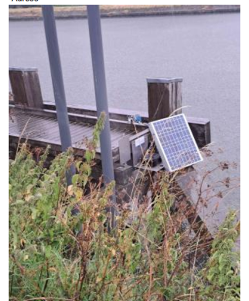
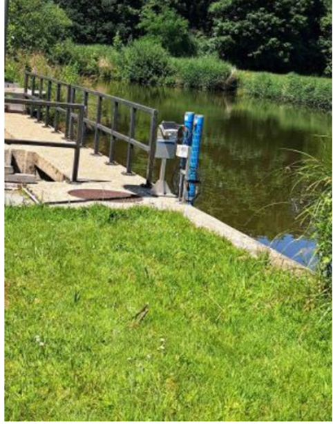
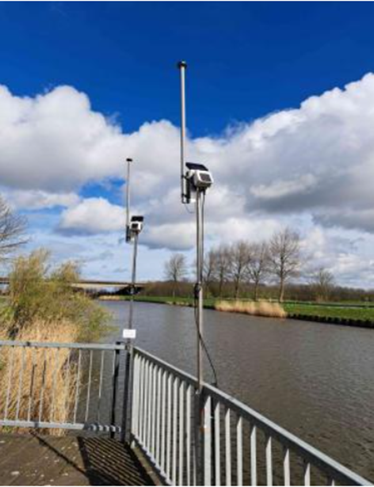
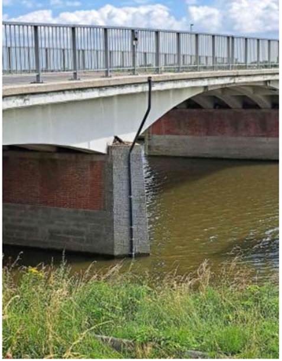
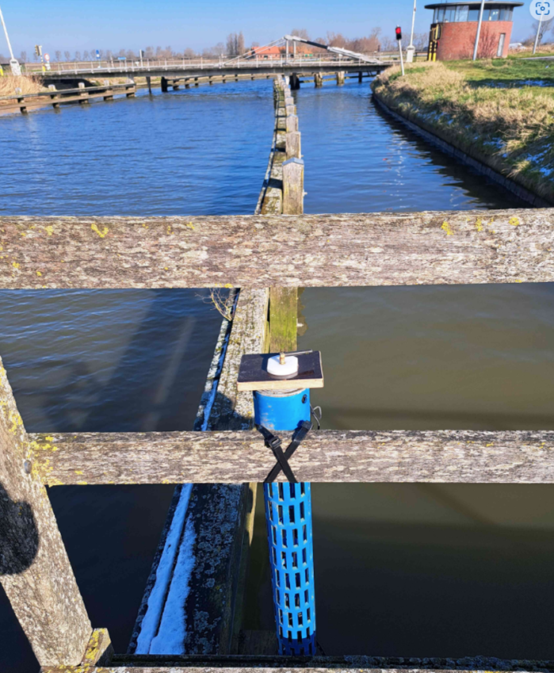
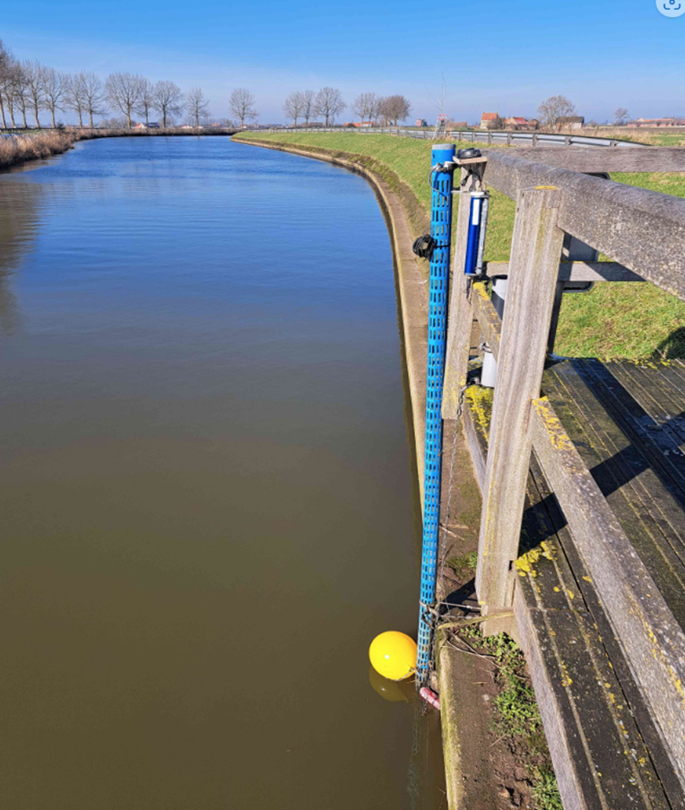
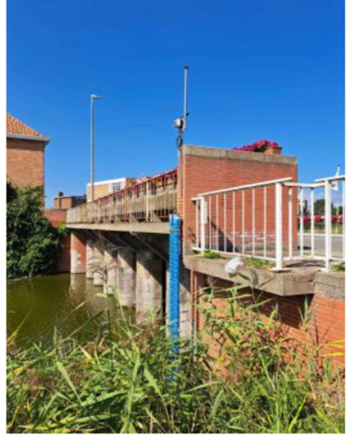
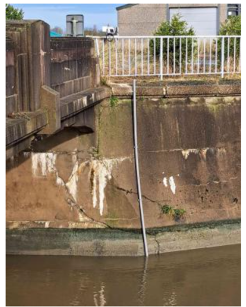

```{r references, results = "asis", echo = FALSE}
# insert the references at this position
# set appendix = FALSE, when the report has no appendix
INBOmd::references(appendix = TRUE)
```

# Appendix

## Instructies tijdelijk stopzetten aangepast spuibeheer

+-------+---------------------------+-----------------+----------------------------------------------------------------------------------------------------------------------------------+
| Site  | Stopzetten bij ...        | INBO ctd        | VMM ctd                                                                                                                          |
+=======+===========================+=================+==================================================================================================================================+
| AKL   | Ramskapelle \> 0.87 mS/cm | akl ramskapelle |                                                                                                                                  |
+-------+---------------------------+-----------------+----------------------------------------------------------------------------------------------------------------------------------+
| LK    | Ramskapelle \> 2.80 mS/cm | lk ramskapelle  |                                                                                                                                  |
+-------+---------------------------+-----------------+----------------------------------------------------------------------------------------------------------------------------------+
| KGO   | Plassendale \> 2.46 mS/cm | plassendale     | IMM0005 Oudenburg Plassendale KanaalGentOostende                                                                                 |
+-------+---------------------------+-----------------+----------------------------------------------------------------------------------------------------------------------------------+
| Ijzer | Tervate \> 2.66 mS/cm     | tervate         | Ijzer EC DWG Tervatebrug (BWO_DWG_CTD_Ijzer_IOW17)                                                                               |
+-------+---------------------------+-----------------+----------------------------------------------------------------------------------------------------------------------------------+
|       | Woumen \> 1.25 mS/cm      |                 | Koevaardeken EC DWG inname Blankaart (BWO_DWG_CTD_Koevaardeken_IOW24): maar precies geen data dus misschien ook dit alternatief: |
|       |                           |                 |                                                                                                                                  |
|       |                           |                 | Diksmuide/IJzer/MPS/WPC Blankaart (BWO_DWG_Exo_Ijzer_IOW3)                                                                       |
+-------+---------------------------+-----------------+----------------------------------------------------------------------------------------------------------------------------------+

## Vergelijking INBO-sensoren en waterinfo-sensoren

```{r}
source("./code/functions/f.plot_compare_inbo_waterinfo.R")
```

```{r}
output="html"
if (output=="html"){
  source('./code/functions/f.map.R')
  file<-read.csv("./data/metadata/coordinaten_ctd.csv",sep=";")
  file[c('X', 'Y')] <- as.numeric(str_split_fixed(file$X..Y, ',', 2))
  file$X..Y<-NULL
  map_object <- f.map(file,"Y","X",crs="+init=epsg:4326","site","loc",plot=TRUE)
  map_object
}
```

### Afleidingskanaal van de Leie en Leopoldskanaal

Er zijn momenteel geen VMM-meetpunten beschikbaar in het AKL en LK. Er was voor 2025 geen afspraak gemaakt over de plaatsing van VMM-sensoren, waardoor de INBO-sensoren van cruciaal belang waren.

### Kanaal Gent-Oostende

Het INBO-meetpunt bij Sas Slijkens, stroomopwaarts van de spuischuiven, speelt een belangrijke rol in het registreren van de binnenkomende zoutwaterhoeveelheid. Op dit moment is er geen direct functioneel alternatief voor dit punt. Het meetpunt van Farys presenteert diverse uitdagingen in de dataverzameling, opslag en ontsluiting, zoals hieronder gespecificeerd.

Het INBO-meetpunt te Plassendale wordt gebruikt om te bepalen of aangepast spuibeheer stilgelegd dient te worden of opnieuw aangevat kan worden. Bij een specifieke conductiviteit van meer dan 2.46 mS/cm wordt het aangepast spuibeheer stilgelegd. Het VMM-meetpunt IMM0005 Oudenburg Plassendale KanaalGentOostende ligt 4 km stroomafwaarts van het INBO-meetpunt, maar trends zijn zeer vergelijkbaar tot en met de week van 21/4/2025 (Fig. \@ref(fig:compplassendale)). Dan is er een plotse daling van het VMM-meetpunt en een almaar grote verschil tussen de trends. Vanaf die datum is er echter een plotse daling van de conductiviteit waarneembaar bij het VMM-meetpunt, met als gevolg een gestaag toenemend verschil tussen de twee meetreeksen.Vanaf die datum is er echter een plotse daling van de conductiviteit waarneembaar bij het VMM-meetpunt, met als gevolg een gestaag toenemend verschil tussen de twee meetreeksen.Vanaf die datum is er echter een plotse daling van de conductiviteit waarneembaar bij het VMM-meetpunt, met als gevolg een gestaag toenemend verschil tussen de twee meetreeksen.Vanaf die datum is er echter een plotse daling van de conductiviteit waarneembaar bij het VMM-meetpunt, met als gevolg een gestaag toenemend verschil tussen de twee meetreeksen.

Het VMM-meetpunt IMC_IOW35 Jabbeke VaartdijkNoord Kan Gent-Oostende is wellicht geen goed alternatief voor het INBO-meetpunt te Brugge. Te trends liggen heel ver uiteen (Fig. \@ref(fig:compbrugge)). Het VMM-meetpunt heeft metingen die in de lijn liggen van het meetpunt te Sas Slijkens. Waarschijnlijk is dit omdat het VMM-meetpunt niet aan het KGO zelf ligt.

+----------------------------------------------------+------------------------------+---------------------------------------------------------------------------+---------------------------------------------------------+
| Code                                               | Alternatief voor INBO-sensor | Afstand tot bodem                                                         | Opmerkingen                                             |
+====================================================+==============================+===========================================================================+=========================================================+
| Meetpunt Farys Sas Slijkens                        | Sas Slijkens                 | Niet gekend                                                               | -   200 meter van huidige INBO sensor                   |
|                                                    |                              |                                                                           |                                                         |
|                                                    |                              |                                                                           | -   In intake-kelder, niet in kanaal                    |
|                                                    |                              |                                                                           |                                                         |
|                                                    |                              |                                                                           | -   Niet ontsloten                                      |
|                                                    |                              |                                                                           |                                                         |
|                                                    |                              |                                                                           | -   Op het eerste zicht verschillende trend INBO-sensor |
|                                                    |                              |                                                                           |                                                         |
|                                                    |                              |                                                                           | -   Watergroep                                          |
+----------------------------------------------------+------------------------------+---------------------------------------------------------------------------+---------------------------------------------------------+
| IMM0005 Oudenburg Plassendale KanaalGentOostende   | Plassendale                  | Afstand tot bodem zou 10 cm zijn (maar waterinfo beschrijving zegt 50 cm) | -   4 km stroomafwaarts van INBO-sensor                 |
|                                                    |                              |                                                                           |                                                         |
|                |                              |                                                                           | -   VMM                                                 |
+----------------------------------------------------+------------------------------+---------------------------------------------------------------------------+---------------------------------------------------------+
| IMC_IOW35 Jabbeke VaartdijkNoord Kan Gent-Oostende | Brugge                       | 10 cm                                                                     | -   4 km stroomafwaarts van INBO-sensor                 |
|                                                    |                              |                                                                           |                                                         |
|                 |                              |                                                                           | -   Niet duidelijk of wel degelijk in KGO               |
|                                                    |                              |                                                                           |                                                         |
|                                                    |                              |                                                                           | -   VMM                                                 |
+----------------------------------------------------+------------------------------+---------------------------------------------------------------------------+---------------------------------------------------------+

```{r compplassendale, fig.cap="Vergelijking tussen de Waterinfo-sensor Oudenburg Kl Gent-Oostende EC Plassendale en de INBO-sensor Plassendale in het KGO."}
plot_compare_inbo_waterinfo("plassendale",
                            "Oudenburg Kl Gent-Oostende EC Plassendale",
                            as.POSIXct("2025-03-01 00:00:00", tz="GMT"),
                            as.POSIXct("2025-05-15 00:00:00", tz="GMT"),
                            "KGO",
                            output)
```

```{r compbrugge, fig.cap="Vergelijking tussen de Waterinfo-sensor Jabbeke VaartDijkNoord KanGentOostende en de INBO-sensor Brugge in het KGO."}
plot_compare_inbo_waterinfo(loc.inbo="brugge",
                            loc.waterinfo="Jabbeke VaartDijkNoord KanGentOostende",
                            date.min=as.POSIXct("2025-03-01 00:00:00", tz="GMT"),
                            date.max=as.POSIXct("2025-05-15 00:00:00", tz="GMT"),
                            canal="KGO",
                            output=output)
```

### Ijzer

In de Ijzer hangen er verschillende sensoren. De VMM-meetpunten die werden geïdentificeerd als mogelijke alternatieven voor de INBO-meetpunten ontbraken dit jaar of er waren problemen met de sensoren. Om die reden waren er geen VMM-sensor alternatieven beschikbaar dit jaar voor de INBO-meetpunten aan de Schoorbakkebrug, Tervate en Diksmuide.

De enige bruikbare VMM-meetpunten waren Nieuwpoort Brugsesteenweg Uniebrug DIEP IMC_999031 aan de Uniebrug en Nieuwpoort/N367/Sluizen ter hoogte van de Yserstar.

Voor beiden waren INBO-metingen consistent hoger dan de VMM-metingen. De trends waren redelijk verschillend voor de Waterinfo-sensor Nieuwpoort Brugsesteenweg Uniebrug DIEP IMC_999031 en INBO-sensor aan de Uniebrug (Fig. \@ref(fig:compuniebrug)). Voor de INBO-sensor aan de Yserstar waren de pieken in conductiviteit een meervoud van die van de Waterinfo-sensor Nieuwpoort/N367/Sluizen in de periode van het aangepast spuibeheer (Fig. \@ref(fig:compyserstar)). Van het einde van het aangepast spuibeheer tot ongeveer 1 april bleven de waarden van de INBO-sensor hoger dan die van de Waterinfo-sensor. Daarna lagen de waarden van de INBO-sensor consistent lager dan die van de Waterinfo-sensor. De minder grote fluctuatie van de Waterinfo-sensor is waarschijnlijk het gevolg van de minder centrale ligging en grotere afstand van de bodem die verhindert om de zouttong op de bodem te capteren.

+--------------------------------------------------------------------+------------------------------+-------------------+----------------------+
| Code                                                               | Alternatief voor INBO-sensor | Afstand tot bodem | Opmerkingen          |
+====================================================================+==============================+===================+======================+
| Nieuwpoort/N367/Sluizen                                            | Yserstar                     | ?                 | -   VMM              |
+--------------------------------------------------------------------+------------------------------+-------------------+----------------------+
| Nieuwpoort Brugsesteenweg Uniebrug DIEP IMC_999031                 | Uniebrug                     | 10 cm boven bodem | -   VMM              |
|                                                                    |                              |                   |                      |
|                                 |                              |                   |                      |
+--------------------------------------------------------------------+------------------------------+-------------------+----------------------+
| Loc-00016-42bis Diksmuide DIEP Schoorbakkebrug (spt-00030-94 diep) | Schoorbakkebrug              | 10 cm boven bodem | -   Niet beschikbaar |
|                                                                    |                              |                   |                      |
|                                |                              |                   | -   Watergroep       |
+--------------------------------------------------------------------+------------------------------+-------------------+----------------------+
| ?                                                                  | Tervate                      |                   | -   Niet beschikbaar |
|                                                                    |                              |                   |                      |
|                                |                              |                   | -   VMM              |
+--------------------------------------------------------------------+------------------------------+-------------------+----------------------+
| Loc-00018-36 Diksmuide Beerstblote IJzer-SafHZV diepe sensor       | Diksmuide                    | 10 cm boven bodem | -   Niet beschikbaar |
|                                                                    |                              |                   |                      |
|                                |                              |                   | -   Watergroep       |
+--------------------------------------------------------------------+------------------------------+-------------------+----------------------+

```{r compyserstar, fig.cap="Vergelijking tussen de Waterinfo-sensor Nieuwpoort N367 Sluizen en de INBO-sensor Yserstar in de Ijzer."}
plot_compare_inbo_waterinfo("yserstar",
                            "Nieuwpoort N367 Sluizen",
                            as.POSIXct("2025-03-01 00:00:00", tz="GMT"),
                            as.POSIXct("2025-05-15 00:00:00", tz="GMT"),
                            "Ijzer",
                            output)
```

```{r compuniebrug, fig.cap="Vergelijking tussen de Waterinfo-sensor Nieuwpoort Brugsesteenweg Uniebrug DIEP en de INBO-sensor Uniebrug in de Ijzer."}
plot_compare_inbo_waterinfo("uniebrug",
                            "Nieuwpoort Brugsesteenweg Uniebrug DIEP",
                            as.POSIXct("2025-03-01 00:00:00", tz="GMT"),
                            as.POSIXct("2025-05-15 00:00:00", tz="GMT"),
                            "Ijzer",
                            output)
```

### Noordede

De trends van de Waterinfo-sensoren en de INBO-sensoren komt niet overeen ondanks ze relatief dicht bij elkaar liggen (Figs. \@ref(fig:compmaertensas) en \@ref(fig:compblauwesluis)). Wellicht liggen de Waterinfo-sensoren te dicht bij het wateroppervlak.

+-------------------------------------------+------------------------------+-------------------+----------------------------------------------+
| Code                                      | Alternatief voor INBO-sensor | Afstand tot bodem | Opmerkingen                                  |
+===========================================+==============================+===================+==============================================+
| Bredene/Nukkerbrug/Noordede IMC_IOW31     | Maertensas                   | ?                 | -   300 meter stroomopwaarts van INBO-sensor |
|                                           |                              |                   |                                              |
|       |                              |                   | -   VMM                                      |
+-------------------------------------------+------------------------------+-------------------+----------------------------------------------+
| Bredene Sluizenstraat Noordede IMC_866000 | Blauwe sluis                 | ?                 | -   0 meter van INBO-sensor                  |
|                                           |                              |                   |                                              |
|       |                              |                   | -   VMM                                      |
+-------------------------------------------+------------------------------+-------------------+----------------------------------------------+
|                                           | Clemensheule                 |                   |                                              |
+-------------------------------------------+------------------------------+-------------------+----------------------------------------------+

```{r compmaertensas, fig.cap="Vergelijking tussen de Waterinfo-sensor Bredene Nukkerbrug Noordede en de INBO-sensor Maertensas in de NE."}
plot_compare_inbo_waterinfo("maertensas",
                            "Bredene Nukkerbrug Noordede",
                            as.POSIXct("2025-03-01 00:00:00", tz="GMT"),
                            as.POSIXct("2025-05-15 00:00:00", tz="GMT"),
                            "NE",
                            output)
```

```{r compblauwesluis, fig.cap="Vergelijking tussen de Waterinfo-sensor Bredene Sluizenstraat Noordede en de INBO-sensor Blauwe Sluis in de NE."}
plot_compare_inbo_waterinfo("blauwe sluis",
                            "Bredene Sluizenstraat Noordede",
                            as.POSIXct("2025-03-01 00:00:00", tz="GMT"),
                            as.POSIXct("2025-05-15 00:00:00", tz="GMT"),
                            "NE",
                            output)
```

### Conclusie en aanbevelingen

#### Waarom overschakelen van Waterinfo-sensoren naar INBO-sensoren?

Het overschakelen van de INBO-meetpunten naar de Waterinfo-meetpunten is aangewezen om verschillende redenen:

-   Real-time metingen die online raadpleegbaar zijn door iedereen

-   Early-warning systeem om snel in te grijpen

-   Beperken van duplicaten metingen en optimaal gebruik van beschikbaar budget

Nadelen zijn:

-   Aanvankelijk redundante metingen kunnen fungeren als back-up indien nodig

-   Verschillen in plaatsing, diepte, etc. kunnen leiden tot aanzienlijk verschillende metingen

#### Wat moet in beschouwing genomen worden bij het weghalen van een INBO-sensor?

Een goede afweging dient gemaakt de worden bij het weghalen van INBO-sensoren.

-   Wordt de INBO-sensor gebruikt om te beslissen of aangepast spuibeheer stilgelegd dient te worden of is het een meetpunt dat meer context geeft bij metingen? De meetpunten stroomopwaarts en stroomafwaarts van het beslissingsmeetpunt worden gebruikt om meer inzicht te krijgen in de ontwikkeling van de zouttong en helpt bij het achterhalen van de oorsprong van plotse stijgingen in geleidbaarheid.

-   Is er een robuust Waterinfo-meetpunt alternatief?

    -   Op een representatieve locatie in de waterloop?

        -   Afstand tot sluizen (longitudinaal): Indien ver verwijderd van INBO-meetpunt dient threshold-waarde mogelijk opnieuw geëvalueerd te worden.

        -   Diepte (verticaal): Bij voorkeur zo dicht mogelijk bij de bodem

        -   Afstand tot de oevers (transversaal): Bij voorkeur zo centraal mogelijk in waterloop

        -   In daadwerkelijke waterloop: Geen zijkanalen

    -   Goede data-ontsluiting?

    -   Weinig tot geen technische problemen mee?

#### Wat met de huidige INBO-sensoren?

De huidige INBO-sensoren zijn einde levensduur en aankoop van nieuwe sensoren dient zoveel mogelijk beperkt te worden.

-   Waar zijn er geen Waterinfo-alternatieven?

-   Waar zijn back-ups voor Waterinfo-meetpunten aangewezen?

Zijn er mogelijkheden voor DVW om de resterende INBO-meetpunten over te nemen zodat, in combinatie met de Waterinfo-meetpunten die het merendeel van de data zouden uitmaken, kort op de bal gespeeld kan worden op vlak van het aangepast spuibeheer?

#### Wat met de verzamelde data?

Ongeacht de gekozen weg m.b.t. de balans tussen Waterinfo-meetpunten en INBO-meetpunten, wordt aangeraden dat het INBO het jaarlijks zoutintrusierapport blijft opmaken waarbij de link tussen het aangepast spuibeheer en zoutintrusie blijvend onderzocht wordt.

## Tijdsreeksen

```{r}
source("./code/not_functions/model_vb.R")
```

```{r langcond, fig.height=10, fig.cap="Gemiddelde specifieke geleidbaarheid (mS/cm) in functie van de tijd voor de verschillende sites en over verschillende afstanden tot de spuischuiven."}
omgeving.as.yearly %>% 
  dplyr::filter(site %in% c("AKL","Ijzer","KGO","LK","NE")) %>%
  ggplot(aes(x=jaar, y=spgeleidbaarheid, group=distance)) + geom_line(aes(colour=distance)) + geom_point(aes(colour=distance)) + facet_wrap(facets = ~ site, scales="free_y") + theme_bw() + ylab("gemiddelde spec. geleidbaarheid (mS/cm)")
```

```{r langp, fig.height=5, fig.cap="Gemiddelde uurlijkse neerslag (mm) in functie van de tijd voor de verschillende sites."}
omgeving.as.yearly %>% 
  dplyr::filter(site %in% c("AKL","Ijzer","KGO","LK","NE")) %>%
  ggplot(aes(x=jaar, y=neerslag, group=site)) + geom_line(aes(colour=site)) + geom_point(aes(colour=site)) + theme_bw() + ylab("gemiddelde neerslag (mm)")
```

```{r langq, fig.height=5, fig.cap="Gemiddelde afvoer (m³/s) in functie van de tijd voor de verschillende sites."}
omgeving.as.yearly %>% 
  dplyr::filter(site %in% c("AKL","Ijzer","KGO","LK","NE")) %>%
  ggplot(aes(x=jaar, y=debiet, group=site)) + geom_line(aes(colour=site)) + geom_point(aes(colour=site)) + theme_bw() + ylab("afvoer m³/s")
```

```{r eval=FALSE, langaas, fig.height=5, fig.cap="Aantal events aangepast spuibeheer (AS) in functie van de tijd voor de verschillende sites."}
omgeving.as.yearly %>% 
  dplyr::filter(site %in% c("AKL","Ijzer","KGO","LK","NE")) %>%
  ggplot(aes(x=jaar, y=events, group=site)) + geom_line(aes(colour=site)) + geom_point(aes(colour=site)) + theme_bw() + ylab("aantal events AS")
```

```{r eval=FALSE, langdas, fig.height=5, fig.cap="Duur aangepast spuibeheer (AS) in functie van de tijd voor de verschillende sites."}
omgeving.as.yearly %>% 
  dplyr::filter(site %in% c("AKL","Ijzer","KGO","LK","NE")) %>%
  ggplot(aes(x=jaar, y=duration, group=site)) + geom_line(aes(colour=site)) + geom_point(aes(colour=site)) + theme_bw() + ylab("duur AS")
```

## Eerdere jaren

### Tabellen

```{r debiettabel}
debiet %>% 
  mutate(jaar=lubridate::year(datum.debiet)) %>% 
  dplyr::filter(jaar>2019) %>%
  group_by(site.debiet,jaar) %>%
  summarize(min = min(debiet,na.rm=TRUE), max = max(debiet,na.rm=TRUE), mean = round(mean(debiet,na.rm=TRUE),digits=2)) %>% 
  kable(caption="Minimum, maximum en gemiddelde debiet (m³/s) per waterloop en jaar.")
```

```{r}
os.summary <- os %>% 
  dplyr::filter(jaar == 2022 & datum < as.POSIXct("2022-05-15 12:00:00", tz = "Europe/Brussels") & datum > as.POSIXct("2022-02-27 00:00:00", tz = "Europe/Brussels")) %>% 
  group_by(site) %>%
  summarize(start = as.Date(min(open)),
            stop = as.Date(max(dicht)),
            periode = round(stop - start),
            aantal.dagen.effectief.os = n_distinct(datum),
            events = n(),
            events.per.dag = round(events/aantal.dagen.effectief.os, digits = 2),
            mediaan.duur.per.event = round(median(duration)),
            mediaan.duur.per.dag = round(mediaan.duur.per.event * events.per.dag),
            totale.duur.os = round(sum(duration)),
            glasaal.per.event = round(mean(glasaal)),
            glasaal.totaal = round(sum(glasaal)))
os.summary$glasaal.totaal[which(os.summary$site == "VA")] = "40730*"
os.summary$start <- format(strptime(as.character(as.Date(os.summary$start)), "%Y-%m-%d"), "%d-%m-%Y")
os.summary$stop <- format(strptime(as.character(as.Date(os.summary$stop)), "%Y-%m-%d"), "%d-%m-%Y")
tos.summary <- as.data.frame(t(os.summary[,-1]))
colnames(tos.summary) <- os.summary$site
rownames(tos.summary) = c("start AS", 
                       "stop AS", 
                       "periode (dagen)", 
                       "# dagen effectief AS", 
                       "# events AS tijdens periode", 
                       "# events AS per dag", 
                       "mediaan duur event AS (min)", 
                       "mediaan duur AS per dag (min)", 
                       "totale duur AS periode (min)", 
                       "verwachte # glasaal per AS event", 
                       "verwachte # glasaal periode")

tos.summary %>% kable(caption = "2022 beleidstabel voor het aangepast spuibeheer (AS) in het afleidingskanaal van de Leie (AKL), Ijzer, kanaal Gent-Oostende (KGO), Leopoldkanaal (LK), Noordede (NE) en Veurne-Ambacht (VA) met inschatting van het aantal glasaal dat de betreffende sluizen kon passeren dankzij AS. * Het verwachte aantal glasaal voor de studieperiode in VA geeft het totaal van 2022 weer en is dus niet gelinkt aan het aantal AS events.") %>% kable_styling(latex_options = "scale_down")
```

```{r}
os.summary <- os %>% 
  dplyr::filter(jaar == 2023 & datum < as.POSIXct("2023-05-15 12:00:00", tz = "Europe/Brussels") & datum > as.POSIXct("2023-02-27 00:00:00", tz = "Europe/Brussels")) %>% 
  group_by(site) %>%
  summarize(start = as.Date(min(open)),
            stop = as.Date(max(dicht)),
            periode = round(stop - start),
            aantal.dagen.effectief.os = n_distinct(datum),
            events = n(),
            events.per.dag = round(events/aantal.dagen.effectief.os, digits = 2),
            mediaan.duur.per.event = round(median(duration)),
            mediaan.duur.per.dag = round(mediaan.duur.per.event * events.per.dag),
            totale.duur.os = round(sum(duration)),
            glasaal.per.event = round(mean(glasaal)),
            glasaal.totaal = round(sum(glasaal)))
os.summary$glasaal.totaal[which(os.summary$site == "VA")] = "75690*"
os.summary$start <- format(strptime(as.character(as.Date(os.summary$start)), "%Y-%m-%d"), "%d-%m-%Y")
os.summary$stop <- format(strptime(as.character(as.Date(os.summary$stop)), "%Y-%m-%d"), "%d-%m-%Y")
tos.summary <- as.data.frame(t(os.summary[,-1]))
colnames(tos.summary) <- os.summary$site
rownames(tos.summary) = c("start AS", 
                       "stop AS", 
                       "periode (dagen)", 
                       "# dagen effectief AS", 
                       "# events AS tijdens periode", 
                       "# events AS per dag", 
                       "mediaan duur event AS (min)", 
                       "mediaan duur AS per dag (min)", 
                       "totale duur AS periode (min)", 
                       "verwachte # glasaal per AS event", 
                       "verwachte # glasaal periode")

tos.summary %>% kable(caption = "2023 beleidstabel voor het aangepast spuibeheer (AS) in het afleidingskanaal van de Leie (AKL), Ijzer, kanaal Gent-Oostende (KGO), Leopoldkanaal (LK), Noordede (NE) en Veurne-Ambacht (VA) met inschatting van het aantal glasaal dat de betreffende sluizen kon passeren dankzij AS. * Het verwachte aantal glasaal voor de studieperiode in VA geeft het totaal van 2023 weer en is niet dus gelinkt aan het aantal as events.") %>% kable_styling(latex_options = "scale_down")
```

```{r}
os.summary <- os %>% 
  dplyr::filter(jaar == 2024 & datum < as.POSIXct("2024-05-15 12:00:00", tz = "Europe/Brussels") & datum > as.POSIXct("2024-02-27 00:00:00", tz = "Europe/Brussels")) %>% 
  group_by(site) %>%
  summarize(start = as.Date(min(open)),
            stop = as.Date(max(dicht)),
            periode = as.numeric(round(stop - start)),
            aantal.dagen.effectief.os = n_distinct(datum),
            events = n(),
            events.per.dag = round(events/aantal.dagen.effectief.os, digits = 2),
            mediaan.duur.per.event = round(median(duration)),
            mediaan.duur.per.dag = round(mediaan.duur.per.event * events.per.dag),
            totale.duur.os = round(sum(duration)),
            glasaal.per.event = round(mean(glasaal)),
            glasaal.totaal = round(sum(glasaal)))
os.summary$glasaal.totaal[which(os.summary$site == "VA")] = "176649*"
os.summary$start <- format(strptime(as.character(as.Date(os.summary$start)), "%Y-%m-%d"), "%d-%m-%Y")
os.summary$stop <- format(strptime(as.character(as.Date(os.summary$stop)), "%Y-%m-%d"), "%d-%m-%Y")
tos.summary <- as.data.frame(t(os.summary[,-1]))
colnames(tos.summary) <- os.summary$site
rownames(tos.summary) = c("start AS", 
                       "stop AS", 
                       "periode (dagen)", 
                       "# dagen effectief AS", 
                       "# events AS tijdens periode", 
                       "# events AS per dag", 
                       "mediaan duur event AS (min)", 
                       "mediaan duur AS per dag (min)", 
                       "totale duur AS periode (min)", 
                       "verwachte # glasaal per AS event", 
                       "verwachte # glasaal periode")

tos.summary %>% kable(caption = "2024 beleidstabel voor het aangepast spuibeheer (AS) in het afleidingskanaal van de Leie (AKL), Ijzer, kanaal Gent-Oostende (KGO), Leopoldkanaal (LK), Noordede (NE) en Veurne-Ambacht (VA) met inschatting van het aantal glasaal dat de betreffende sluizen kon passeren dankzij AS. * Het verwachte aantal glasaal voor de studieperiode in VA geeft het totaal van 2024 weer en is niet dus gelinkt aan het aantal as events.") %>% kable_styling(latex_options = "scale_down")
```

### Grafieken

#### 2020

```{r}
ctd.app<-process_ctd_series_for_plotting(date.min=as.POSIXct("2020-03-01 00:00:00", tz="GMT"), date.max=as.POSIXct("2020-05-15 00:00:00", tz="GMT"))
```

```{r}
ctd.app$AKL
```

```{r}
ctd.app$LK
```

```{r}
ctd.app$KGO
```

```{r}
ctd.app$Ijzer
```

#### 2021

```{r}
ctd.app<-process_ctd_series_for_plotting(date.min=as.POSIXct("2021-03-01 00:00:00", tz="GMT"), date.max=as.POSIXct("2021-05-15 00:00:00", tz="GMT"))
```

```{r}
ctd.app$AKL
```

```{r}
ctd.app$LK
```

```{r}
ctd.app$KGO
```

```{r}
ctd.app$Ijzer
```

#### 2022

```{r}
ctd.app<-process_ctd_series_for_plotting(date.min=as.POSIXct("2022-03-01 00:00:00", tz="GMT"), date.max=as.POSIXct("2022-05-15 00:00:00", tz="GMT"))
```

```{r}
ctd.app$AKL
```

```{r}
ctd.app$LK
```

```{r}
ctd.app$KGO
```

```{r}
ctd.app$Ijzer
```

```{r}
ctd.app$NE
```

#### 2023

```{r}
ctd.app<-process_ctd_series_for_plotting(date.min=as.POSIXct("2023-03-01 00:00:00", tz="GMT"), date.max=as.POSIXct("2023-05-15 00:00:00", tz="GMT"))
```

```{r}
ctd.app$AKL
```

```{r}
ctd.app$LK
```

```{r}
ctd.app$KGO
```

```{r}
ctd.app$Ijzer
```

```{r}
ctd.app$NE
```

#### 2024

```{r}
ctd.app<-process_ctd_series_for_plotting(date.min=as.POSIXct("2024-03-01 00:00:00", tz="GMT"), date.max=as.POSIXct("2024-05-15 00:00:00", tz="GMT"))
```

```{r}
ctd.app$AKL
```

```{r}
ctd.app$LK
```

```{r}
ctd.app$KGO
```

```{r}
ctd.app$Ijzer
```

```{r}
ctd.app$NE
```
